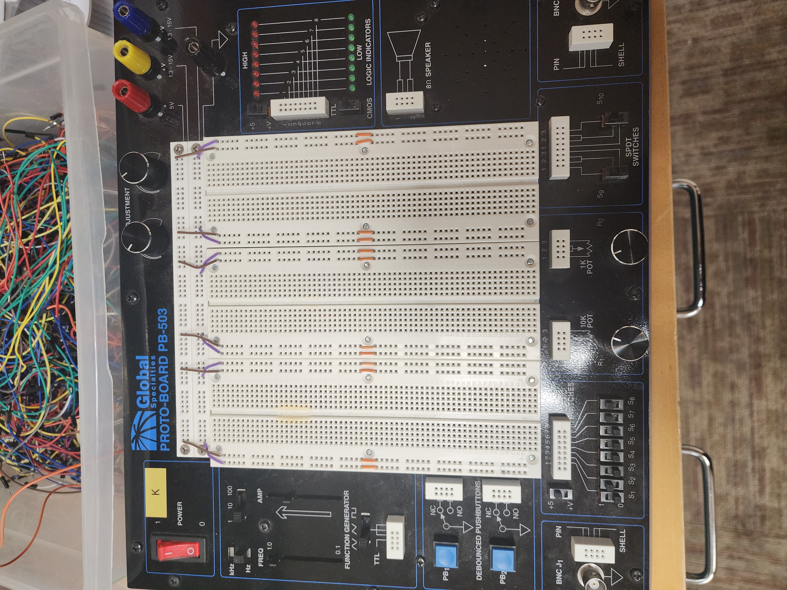
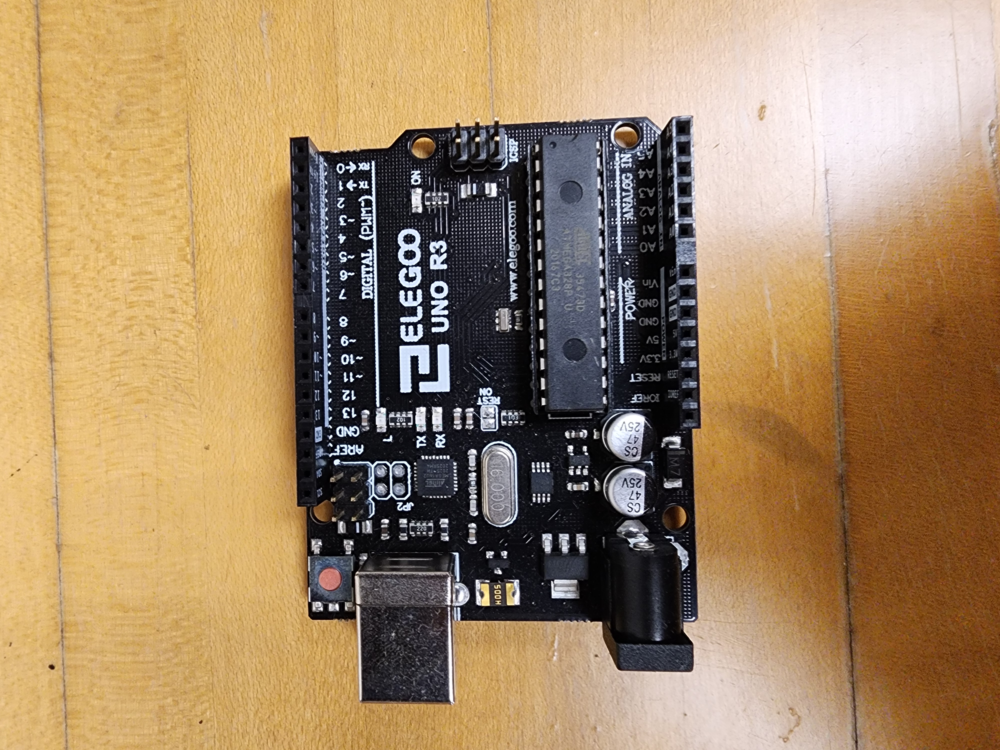
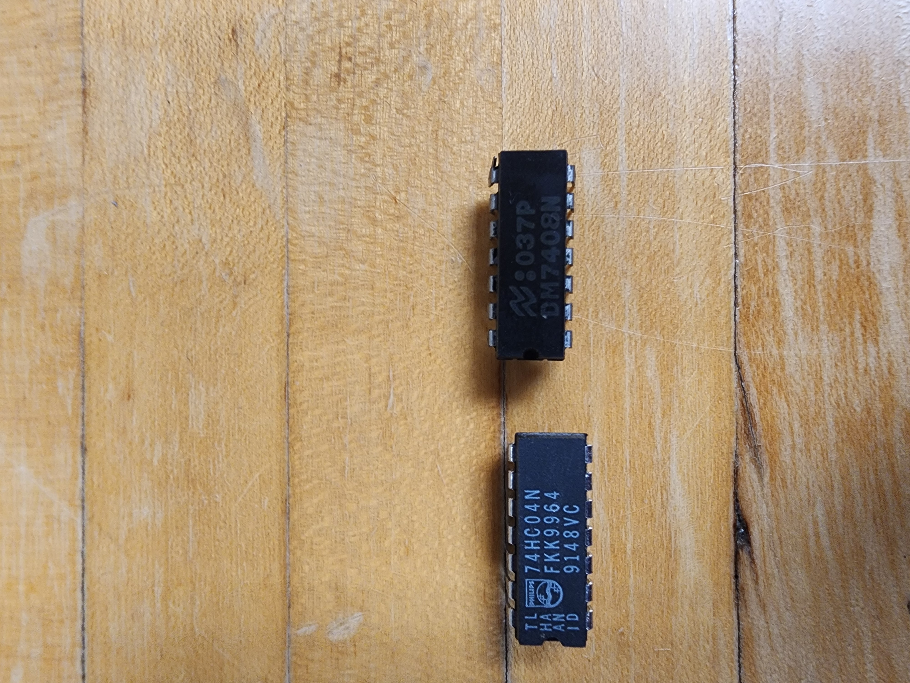

# Lab 1: Doing stuff with hardware!

Group 6: Long Pham, Vuong Nguyen, Utsav Sapkota

## Overview and Motivation
This week we'll explore some common hardware components, most notably the PB-503 breadboard prototyping stations and the Arduino - a microcontroller system for embedded processor control, as well as other circuit components like LEDs, resistors, and logic gates. After this lab, we will gain crucial knowledge about what these components are, where they are set up in relation to each other, and how we do so to make the circuit work properly. Understanding these points will allow us to move on with other components in future labs. 5 demos with images and videos will be provided below to support better understanding of the material. 

## Materials
The two major materials that we need are the PB-503 breadboard prototyping stations and the Arduino. The PB-503 contains electrical components like switches, LEDs, power supplies, and function generators that surround a circuit prototyping board, called a breadboard. 

 

The Arduino is a microcontroller system accompanied by its dedicated IDE. Here, we power up and transfer the control program to the Arduino using a USB cable connected to our laptop.

 


 We also introduce two logic gates - the NOT gate and the AND gate, which can be used to perform Boolean logic operation and return a single bit as output. 

 
 
 

 Finally, we have wires with different colors to avoid cluttering during the wiring process.
## Project Steps 

We started off this lab by obtaining PB-503 breadboard prototyping stations and the Arduino kit. As we plugged in our board as switched the power supply button on, the power supply button light light up which meant our board is in good condition and is ready to use. 

Now, we learned that we needed to supply power from the PB-503 into the breadboard which was connected and was in the middle of the PB-503 breadboard. We learned that we will only be using +5 Volts as our power supply. Not just for this lab, but for the whole semester so we learned that we don't need to hook a wire to any other power voltages. To send power into our breadboard (in the middle), we connected +5volts in the brown wire row, and 0volts (GND) in the green wire row. The +5 volts of power was pulled in the breadboard from Red, and the GND was brought to the breadboard from Black power supply of the PB-503 station. Now, we had +5volts and 0volts running in our breadboard. We know this is true because we noticed a pattern of +5volts (brown wire) and 0volts (green wire) connecting all around the board except the column of 5 holes, which were not connected to any power supply. The holes with 5 columns seemed to be connected across the rows underneath the breadboard but at the moment, they had no power. 

We tested the power output of different locations in breadboard by connecting a wire, one end of the wire to the testing hole in breadboard and other in the Logic Indicators. If there was +5volts, the red light lit up and if there was 0volts then the green light lit up in the Logic Indicators. We also noticed that the floating pins (holes with 5 columns) was nither high or low. This makes sense since at the moment, we hadn't connected anything to the floating pin, meaning we had no power brought to the floating pins. 

After understanding the basics of how the breadboard is connected and how the power (+5 volts and 0 volts) were supplied throughout the breadboard (using brown and green wires), we moved towards **building our first LED light circuit**. To light the LED bulb, we connected the long side of the LED bulb to +5 volts and the short side to GND. We learned that the long and short side matters since current only flows in one direction through an LED. After this, we also connected a resistor inbetween pulling the power from +5volts (brown wire row) which made sure LED was receiving the volts needed. 

We conitnued to change our LED circuit a little. We will **add the Functions Generator into our circuit to make the behavior of the LED light more interesting**. We substituted the function generator for the +5 volts input into our LED circuit. The function generator helped us control the Hz, Frequency and other minor things which was not controlled earlier when we directly plugged power from +5 volts (Brown wire row). After connecting with the function generator, we set the switch to square wave. We also set the top switch to "1". We changed the other top switch to Hz from KHz. We set the right slider to the top setting as well since we wanted the max voltage. The slider change meant we were accessing different fractions of our max voltage of +5 volts. After successfully connecting our LED circuit with function generator, our LED light up. We also noticed that 1Hz slowed down the blinking frequency. Setting it to 10Hz made the light blink faster than ever before. We learned that AMP was the power in Volts. Hence, AMP slider adjusts the brightness of the LED.

We moved onto the second circuit. We built an Inverter Gate with a 7404 (Inv or Not) chip. We learned how fragile these IC chips could be so we worked with them with the utmost care. As we connected the Inverter IC chip, we supplied it power through the Vcc (top right), and GND (bottom left). The 7404 Inv datasheet is very helpful in learning how this was supposed to be used. From the datasheet, we learned that the A/Y pins were used as Inputs and Outputs. We connected our input (first row of left hole) and output as (second row of left hole) in the logic indicators. The input (A pin, 1A) came from the function generator. This input was also connected to logic probe LED which was for use to check if it was working as intended. After this, we wired the output to another logic probe. After testing, we noticed that the logic probe was lighting up high or low depending on the signal connected to it.

Now, we moved on to build a citcuit with AND gate. This chip was almost similar to the 7404 IC (NOT gate) but instead of just one input, it has two inputs and a output. Of course there were multiple instances of these two inputs and output in the chip which meant we could use 1 7408 chip as multiple AND gates. (It had upto 4A/B and 4Ys) This meant the chip provided four independent AND gates. To use this, we supplied +5 volts (top right) and 0volts/GND (bottom left). Next, we wired the first input pin of the AND gate to the first switch, S1 and the second input pin in the second switch, S2. After making sure power is supplied, we noticed that these inputs could be changed from the Switch Panel. By hand toggling through all four conbinations of High and Low, we noticed that it corresponds and functions like the truth table of AND Gate. 

Last part of the lab was the use Arduino- an embedded controller - to improve our AND gate and we implemented the following code into Arduino.
```
Const int P = 13;
Const int A = 1000;
Const int B = 1000;

void setup(){
    pinMode(p, OUTPUT);

}
void loop(){
    digitalWrite(P, HIGH);
    delay(A);
    digitalWrite(P, LOW);
    delay(B);
}
```

We implemented this code to control S1 (looping it to be 0, 1) while manually controlling s2 to see the results (AND Gate Truth Table). It worked as intended since S1 = 0 and S2 = 0 was 0, S1 = 0, S2 = 1 was also 0, S1 = 1 and S2 = 0 was also 0 and at last, S1 and S2 as 1 gave a result of 1.

Not just this, when we changed the value of A and B to 500, the LED blink faster, and when we set it to 2000, it was blinking slower. This was the milisecond time that we changed. The value of P can also be changed but the wire (input) going into pin11 should also be changed to what the value of P is. During our experiment, we changed the P to 13, and connected the input wire to pin 13, which still perfectly worked.


## Testing 
Since we have 5 circuits in our lab, this section will show we test each circuit to see if they work or not. 
### Breadboards
#### 1. Testing HIGH and LOW voltage locations:
As we get to know the basic structure breadboards, there are +5 Volts and 0 Volts locations on the breadboards.  In order to test whcih locations are HIGH and LOW, we use the ste of onboard Logic Indicators on the breadboard. Use 1 wire and connect one end to on the Logic Indicators. Connect the other end to the hole on the breadboard that you want to check if it is HIGH or LOW. If the LED lights up RED, the hole is a +5 Volts hole. Otherwise, the LED will light up GREEN meaning that hole is a Ground hole. 

### Testing the first circuit:
In the first circuit, we will light a LED with a 330 Ohm resistor. To test if we correctly wire the circuit. First, to check if our circuit is correct, before turning on the power, we will do wiring check. 
1. Short side of the LED must be connected to 0V hole (or Ground hole).
2. One end of the resisitor is connected to the **long end** of the LED.
3. The other end of hte resistor is connected to +5V hole. (This mean the long end of the LED is connected to the +5V power hole).
Then, we test if the logic works. Turn on the breadboard. If the LED lights up, it means there is a +5V power supply runs though the circuit that lights up the LED. Else, there might be no power supplied, you might want to go back to the wiring check. 

[First circuit](https://drive.google.com/file/d/125omqCzj0A8ZqIJAOrT1mvoiqVdbeBFR/view)

#### Function generator
Now, we will learn how to control the power (in this lab we use +5V) that is directed into the circuit. **First, we turn off the breadboard**. Then, follow the instructions to switch to Functions generator.

1. On the Functions Gnerator, set the switch to a square wave.
2. Set the top switch to “1”.
3. Set the other **top switch** to Hz (not KHz).
4. Set the left slider (FREQ) to 1.0 (this FREQ slider will modify the lighting frequency of the LED).
5. Set the right slider (AMP) to its top setting; (this slider can be used to select part of the max voltage, a fraction of our usual +5V).
6. Take a long wire. Connect one end to one of the six non-TTL pins **below the function gener- ator**. Connect the other end to the high (+5) connection to the LED circuit.

After finish the wiring, your circuit should look like the one below. 

[Function generator](https://drive.google.com/file/d/1DcgIB4-4X2fY28Wv1PRRag3uFoaa_9tN/view)

Now, when we turn on the breadboard, we will see that our LED blinks on and off. Now try to see what the AMP and the FREQ sliders do to our LED. Hz on the switch board above the represents the frequency in which the current changes direction per second. This makes the LED blinks on and off. Hence, 1 Hz means the frequency of direction changes per second is 1Hz (meaning 1 cycle per second). 10 Hz means the frequency of the direction changes per second is 10 Hz. Therefore, when we change FREQ slider, moving it closer to 0.1, the LED blinks slower. 

When we change the AMP slider, we will see the light on our LED gradually dims. As we adjust the AMP slider and the FREQ slider, we will observe "phase transitions" in the behavior of LED. This refers to the flickering of the LED. 

[Video shows the changing in brightness of LED](https://www.youtube.com/shorts/iH4BwUF_pzY)


#### Logic gate: inverter
In this section, we will learn how to use the inverter 7404 IC in our circuit.First, let's turn off the breadboard before we build another circuit. Now, find the 7404 IC. The upper right hand corner of the IC is to be connected to VCC (which is +5V power supply source). The lower left corner is to be connected to Ground (labeled as GND). The notch of the inverter indicates the "top" of the IC. 

Each IC will have 6 inverters. The input pins are marked as A (1A, 2A, ect.,). The output pins are marked as Y (1Y, 2Y, etc.,). Now we will build a circuit with our inverter. 
1. Take a wire and connect the function generator to one of the input pins on the IC (plug the other end of that wire onto the same row with one of the input pins on the IC)
2. Connect Logic probe 1 to the same input pins (the one that has just been connected to Square Wave generator).
3. The output of the inverter will be connected to the logic probe 2. 
4. Now, connect Vcc and GND to +5V hole and 0V hole as usual. 

When we provide a +5V power supply through the circuit, we will see that the the LED on the Logic probe 1 lights up. This means there is power run thtough the circuit and the LED. Now, since this is an inverter IC, when the logic probe 1's LED is on, the Logic Probe 2 LED, the one that is connected to the output of the inverter will lights up GREEN. This means the power running thorugh the LED is at 0V. Now, we see the logic when using this inverter. Whenever the input power is HIGH (which also means 1), the output observed at the logic probe 2 is LOW (also means 0). When we change the input power on hte Function Generator board, the LED on the logic probe alternatively. This circuit helps we see how the inverter works.

[Circuit with inverter gate](https://drive.google.com/file/d/1hgqqtnTt2cKdJXsgBoLntzOYMCUAosDY/view)

#### Logic gate: AND gate
The 7408 chip provides 4 independent AND gates. Each gate has 2 inputs pins and 1 output pin. In this section, we build a circuit with the AND gate. 

We wire the Vcc of the chip to the +5V hole on the breadboard and the GND to the 0V hole on the breadboard. For the 2 inputs, we wire the first input to the S1 on the SWITCH panel. The second input is wired to the S2 on the same SWITCH panel. The output (Y) is to be connected to the Logic probe LED. 

Now, we test the logic of the AND gate. When the S1 is on and S2 is turned off, the LED lights up GREEN meaning the output is at LOW (0V). The same scenario will be observed when we toggle the S1 off and turn on the S2. This means the output is 0 when only one of the 2 inputs is 1. When we turn on both S1 and S2, the LED lights up RED. This means the oputput is 1. Thus, we can see that the circuit follows closely the truth table for the AND gate. 

#### Arduino Control:
In this section, we learn how to use Arduino controller to operate the circuit independently of any manual input. Now, we wire the Arduino into our circuit as an input.
1. Take the 7408 IC chip. Wire the pin 13 on the Arduino to the first input on the 7408 IC.
2. Wire the S2 to the second input pin. 
3. Wire both GND and Vcc to Ground and +5V holes, respectively. 
4. The output of the AND gate will be wired logic probe. 

[Connecting Arduino to the circuit](https://drive.google.com/file/d/1WuIVBAnY8hIiU71c3gqOzUN69KwwkTGf/view)

Now, we will follow the program to operate the circuit. 
```
const int P = 13;
const int A = 1000;
const int B = 1000;
void setup() {
    pinMode(P, OUTPUT);
}
void loop() {
    digitalWrite(P, HIGH);
    delay(A);
    digitalWrite(P, LOW);
    delay(B); 
}
```

[Arduino program](https://drive.google.com/file/d/1Fu5tNwW0XBNYwG7SRqyt6hoSWxfXtKmy/view)

In this program, we can see that variable P refers to the number of the pin that the program operate on. In this case, since we wire the circuit with Arduino via the pin 13, P=13. A and B represent some unit of time in which we want the program to operate on hte circuit. The function ```loop``` developed to operate the circuit. With the switch S2 set to HIGH,```digitalWrite(P, HIGH)``` tells the circuit to input a power supply at HIGH (+5V) through the circuit. This makes the LED light up RED. Then ```delay(A)``` is called. This tells the circuit to stay still for some A (=1000) units of time after continue to run the next function. Then ```digitalWrite(P, LOW)``` provides the LOW power (0V) to the circuit, making the LED green up. Similarly,```delay(B)``` is called tells the circuit to stop for some B units of time before running the next function. This program makes the LED lights on and off alternately. 

Now, take a look at the S2. Since we are using the AND gate, when we switch the S2 to off, the LED will turn green even though the Arduino is plugged. This means no power is running through the LED. When we change the value of A and B to 2 smaller numbers, the LED blinks faster. The value of P can only be changed if we change the pin connecting Arduino to the circuit. 

## Conclusion

This lab introduced us to essential computer hardware components, covering breadboards, Arduino, IC chips, and more. Hands-on activities provided a foundational understanding of how these components work together in a computer system and how we can use this background in future labs.

