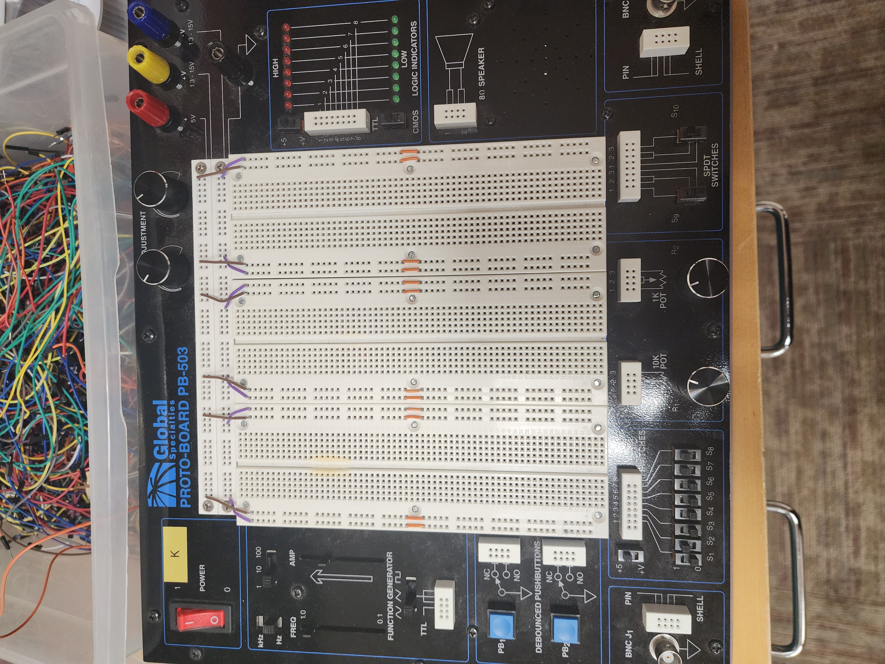
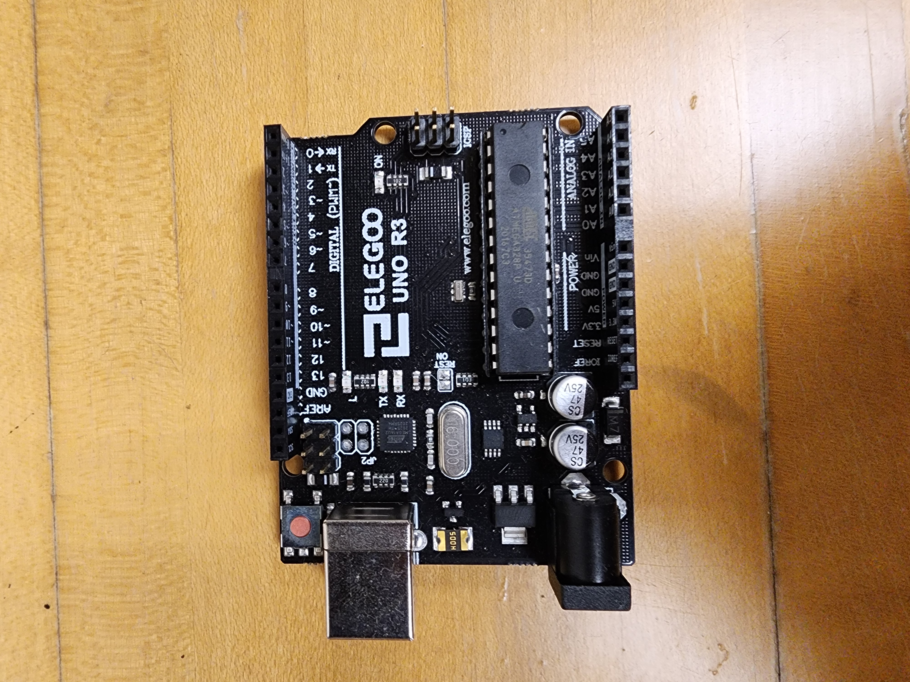
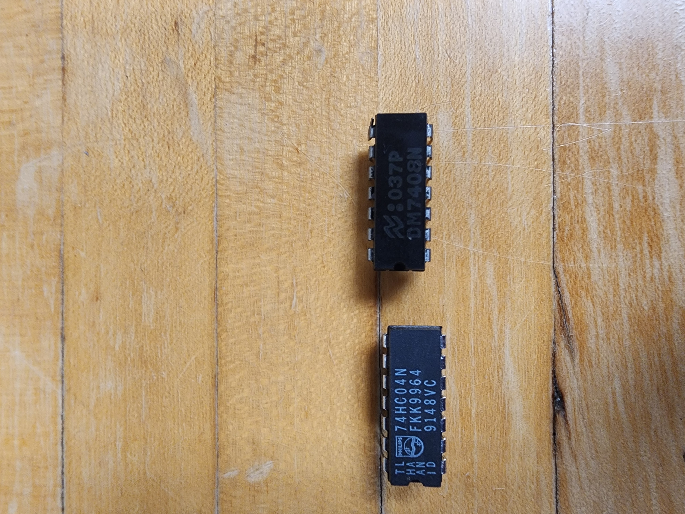

# Lab X: Doing stuff with hardware!

Please write a blog post describing your lab here.

This is just an example of how you might structure your blog post, feel free to edit as you wish. For example, you might divide the lab into different sections each with their own intro, instructions, results, and takeaways. Please see the rubric for details on how the post will be evaluated.

## Overview and Motivation
This week we'll explore some common hardware components, most notably the PB-503 breadboard prototyping stations and the Arduino - a microcontroller system for embedded processor control, as well as other circuit components like LEDs, resistors, and logic gates. After this lab, we will gain crucial knowledge about what these components are, where they are set up in relation to each other, and how we do so to make the circuit work properly. Understanding these points will allow us to move on with other components in future labs. 5 demos with images and videos will be provided below to support better understanding of the material. 

## Materials
The two major materials that we need are the PB-503 breadboard prototyping stations and the Arduino. The PB-503 contains electrical components like switches, LEDs, power supplies, and function generators that surround a circuit prototyping board, called a breadboard. 

 

The Arduino is a microcontroller system accompanied by its dedicated IDE. Here, we power up and transfer the control program to the Arduino using a USB cable connected to our laptop.

 

 We also introduce two logic gates - the NOT gate and the AND gate, which can be used to perform Boolean logic operation and return a single bit as output. 

 
 
 

 Finally, we have wires with different colors to avoid cluttering during the wiring process.
## Project Steps ##Utsav

We started off this lab by obtaining PB-503 breadboard prototyping stations and the Arduino kit. As we plugged in our board as switched the power supply button on, the power supply button light light up which meant our board is in good condition and is ready to use. 

Now, we learned that we needed to supply power from the PB-503 into the breadboard which was connected and was in the middle of the PB-503 breadboard. We learned that we will only be using +5 Volts as our power supply. Not just for this lab, but for the whole semester so we learned that we don't need to hook a wire to any other power voltages. To send power into our breadboard (in the middle), we connected +5volts in the brown wire row, and 0volts (GND) in the green wire row. The +5 volts of power was pulled in the breadboard from Red, and the GND was brought to the breadboard from Black power supply of the PB-503 station. Now, we had +5volts and 0volts running in our breadboard. We know this is true because we noticed a pattern of +5volts (brown wire) and 0volts (green wire) connecting all around the board except the column of 5 holes, which were not connected to any power supply. The holes with 5 columns seemed to be connected across the rows underneath the breadboard but at the moment, they had no power. 

We tested the power output of different locations in breadboard by connecting a wire, one end of the wire to the testing hole in breadboard and other in the Logic Indicators. If there was +5volts, the red light lit up and if there was 0volts then the green light lit up in the Logic Indicators. We also noticed that the floating pins (holes with 5 columns) was nither high or low. This makes sense since at the moment, we hadn't connected anything to the floating pin, meaning we had no power brought to the floating pins. 

After understanding the basics of how the breadboard is connected and how the power (+5 volts and 0 volts) were supplied throughout the breadboard (using brown and green wires), we moved towards building our first LED light circuit. To light the LED bulb, we connected the long side of the LED bulb to +5 volts and the short side to GND. We learned that the long and short side matters since current only flows in one direction through an LED. After this, we also connected a resistor inbetween pulling the power from +5volts (brown wire row) which made sure LED was recieving the volts needed. 

Next, we substituted the function generator for the +5 volts input into our LED circuit. The function generator helped us control the Hz, Frequency and other minor things which was not controlled earlier when we directly plugged power from +5 volts (Brown wire row). After connecting with the function generator, we set the switch to square wave. We also set the top switch to "1". We changed the other top switch to Hz from KHz. We set the right slider to the top setting as well since we wanted the max voltage. The slider change meant we were accessing different fractions of our max voltage of +5 volts. After successfully connecting our LED circuit with function generator, our LED light up. We also noticed that 1Hz slowed down the blinking frequency. Setting it to 10Hz made the light blink faster than ever before. We learned that AMP was the power in Volts.

Next, we built an Inverter Gate with a 7404 (Inv or Not) chip. We learned how fragile these IC chips could be so we worked with them with the utmost care. As we connected the Inv. IC chip, we supplied it power through the Vcc (top right), and GND (bottom left). The 7404 Inv datasheet was very helpful in learning how this was supposed to be used. From the datasheet, we learned that the A/Y pins were used as Inputs and Outputs. We connected our input (first row of left hole) and output as (second row of left hole) in the logic indicators. The input (A pin, 1A) came from the function generator. This input was also connected to logic probe LED which was for use to check if it was working as intended. After this, we wired the output to another logic probe. After testing, we noticed that the logic probe was lighting up high or low depending on the signal connected to it.

Our next task was to test the 7408 IC (and gate). This chip was almost similar to the 7404 IC (Not gate) but instead of just one input, it had two inputs and a output. Of course there were multiple instances of these two inputs and output in the chip which meant we could use 1 7408 chip as multiple and gates. (It had upto 4A/B and 4Ys) This meant the chip provided four independent AND gates. To use this, we supplied +5 volts (top right) and 0volts/GND (bottom left). Next, we wired the first input pin of the AND gate to the first switch, S1 and the second input pin in the second switch, S2. After making sure power is supplied, we noticed that these inputs could be changed from the Switch Panel. By hand toggling through all four conbinations of High and Low, we noticed that it corresponds and functions like the truth table of And Gate. 

Last part of the lab was the use Arduino- an embedded controller - to improve our AND gate and we implemented the following code into Arduino.

"
Const int P = 13;
Const int A = 1000;
Const int B = 1000;

void setup(){
    pinMode(p, OUTPUT);

}
void loop(){
    digitalWrite(P, HIGH);
    delay(A);
    digitalWrite(P, LOW);
    delay(B);
}

"

We implemented this code to control s1 (looping it to be 0, 1) while manually controlling s2 to see the results (And Gate Truth Table). It worked as intended since s1 = 0 and s2 = 0 was 0, s1 = 0, s2 = 1 was also 0, s1 = 1 and s2 = 0 was also 0 and at last, s1 and s2 as 1 gave a result of 1.

Not just this, when we changed the value of A and B to 500, the LED blink faster, and when we set it to 2000, it was blinking slower. This was the milisecond time that we changed. The value of P can also be changed but the wire (input) going into pin11 should also be changed to what the value of P is. During our experiment, we changed the P to 13, and connected the input wire to pin 13, which still perfectly worked.

## Testing ##Vuong

## Conclusion ##Long's

